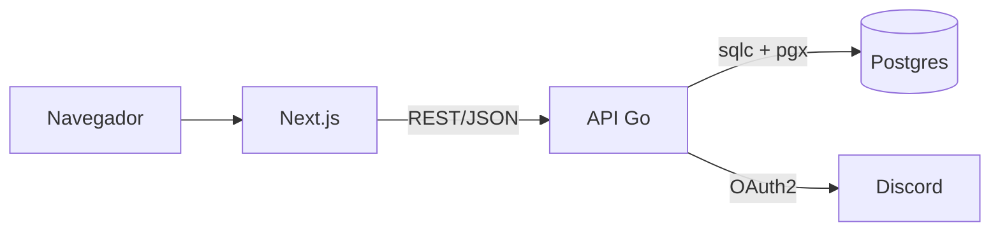
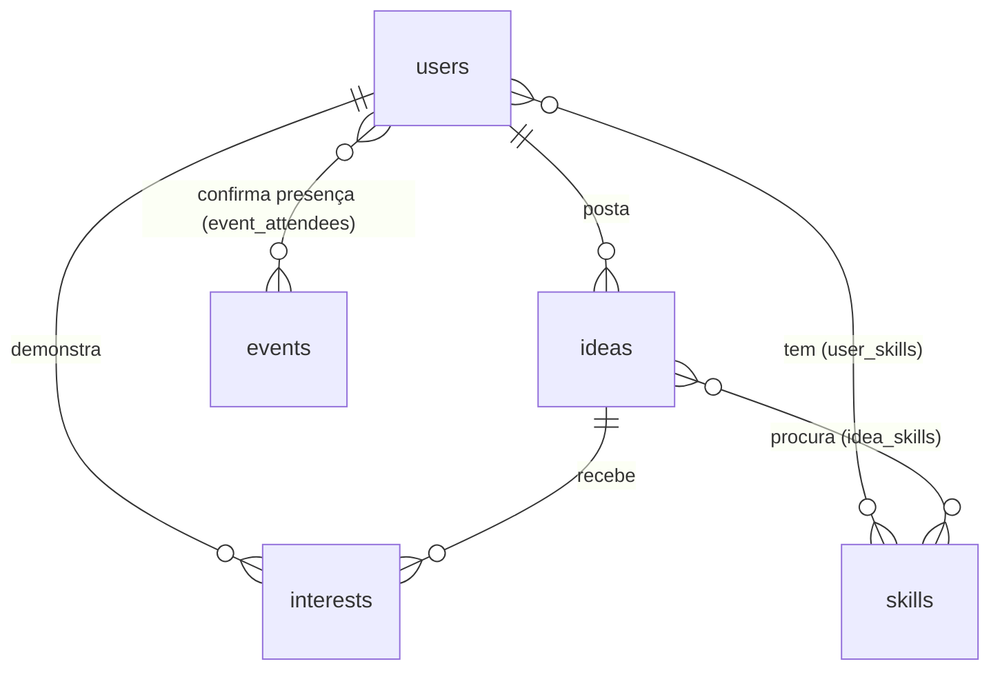

# PRD — Plataforma de Projetos de TI (FAESA)

8 de outubro de 2026 · Davi de Souza

Documento de requisitos do produto, focado no MVP. Enxuto no texto, completo no conteúdo — serve para dar contexto pleno do projeto a qualquer pessoa ou IA que for implementar.

## Visão geral

**O que é:** uma plataforma web para alunos de TI da FAESA (Ciência da Computação, Engenharia e ADS) acharem parceiros de projeto e terem mais oportunidades de botar a mão na massa juntos.

**Problema:** alunos querem fazer mais projetos e eventos da área, mas falta gente para montar time, falta comunicação entre quem tem ideia e quem quer participar, falta um meio onde isso aconteça, e há poucas oportunidades de mão na massa (o hackathon acontece cerca de uma vez por ano).

**Público:** alunos dos cursos de TI da FAESA. O autor do projeto é líder de turma e tem contato com os demais líderes.

**Escopo do MVP — duas pernas:**

- Mural de ideias: onde o aluno posta uma ideia de projeto e encontra gente para participar.
- Aba de eventos: onde a comunidade organiza e confirma presença em encontros, dias de trabalho e hackathons.

A conversa dos grupos acontece no Discord central da comunidade — a plataforma não constrói chat, só aponta para lá.

## Stack e arquitetura

**Back-end:** Go, expondo uma API REST.

**Front-end:** Next.js (React), que serve as páginas e consome a API.

**Banco:** PostgreSQL. Acesso com sqlc (gera código Go tipado a partir de SQL puro), driver pgx, e migrations com goose. Sem ORM.

**Autenticação:** login via Discord OAuth. A conversa dos grupos vive no Discord central da comunidade.

**Repositório:** monorepo — um único repositório com as pastas backend e frontend. Organização do Go começando simples (cmd para a entrada, internal por domínio).

**Deploy:** VPS própria (Hostinger), cada parte em um container Docker, com um proxy reverso Caddy na frente distribuindo por subdomínio e cuidando do HTTPS, sem conflitar com o que já roda na VPS.

O navegador fala com o front em Next.js, que chama a API em Go; a API acessa o Postgres e valida o login pelo Discord.

## Modelo de dados

Tabelas principais do MVP:

- **users:** o aluno. id, discord_id, nome, foto, curso.
- **ideas:** a ideia postada. id, autor (users), título, descrição, curso, categoria, número de vagas, status (aberta, em andamento, concluída).
- **interests:** quem clicou em "quero participar". Liga um user a uma idea.
- **skills:** catálogo de habilidades (front, back, design, dados). Liga-se a users (habilidades do aluno) e a ideas (habilidades procuradas) por tabelas de junção.
- **events:** o evento. id, título, data, local. Presença confirmada também vira uma ligação entre user e event.

Um aluno posta várias ideias; cada ideia reúne vários interessados; habilidades são compartilhadas entre perfis e ideias.

## Funcionalidades do MVP

**1. Login com Discord**

- O aluno entra clicando em "entrar com Discord" (OAuth).
- Na primeira entrada, cria-se o perfil a partir dos dados do Discord (nome, foto).
- Sem cadastro de senha; o Discord é a identidade.

**2. Mural de ideias**

- Lista de ideias postadas, mais recentes primeiro.
- Cada card mostra título, curso, categoria, vagas e habilidades procuradas.
- Botão para postar uma nova ideia (título, descrição, curso, categoria, quantas pessoas precisa, habilidades procuradas).
- Comentários em cada ideia.

**3. Participar de uma ideia**

- Botão "quero participar" em cada ideia.
- Sem aprovação: o interesse entra direto na lista.
- O autor vê a lista de interessados numa aba e chama a galera pelo Discord.

**4. Status da ideia**

- O autor controla o status: aberta, em andamento, concluída.
- O autor decide quando trava novos interessados.
- Ideia concluída vai para a vitrine de projetos concluídos.

**5. Perfil do aluno**

- Nome, foto, curso, habilidades.
- Ideias que postou e ideias que participou.

**6. Descoberta**

- Filtros por curso, categoria, habilidade procurada e status.
- Busca por texto.

**7. Eventos**

- Aba com a lista de eventos (título, data, local).
- Qualquer aluno pode criar um evento; eventos são independentes de ideias.
- Confirmação de presença ("vou").

## Regras de negócio e fora de escopo

**Regras principais**

- Só aluno logado (via Discord) interage; visitante pode ver a vitrine de concluídos.
- A lista de interessados é aberta, sem aprovação — o espírito é conhecer gente nova.
- Apenas o autor da ideia muda o status dela e trava novos interessados.
- A coordenação real dos grupos acontece no Discord, não na plataforma.

**Fora de escopo no MVP (vai para fases futuras)**

- Chat e troca de ideia livre (fica no Discord).
- Aba de professor com avaliação acadêmica.
- Bot do Discord criando call automática quando o grupo fecha.
- Build in public (acompanhamento diário), seguir pessoas e feed.
- "Tô disponível" para aluno sem ideia.
- Link de repositório na vitrine, hackathons e desafios internos.

**Régua de decisão:** a pergunta não é "isso é legal?", é "sem isso, a dor principal continua sem solução?". Se a resposta é não, é desejável, não essencial — e vai para a fila.
