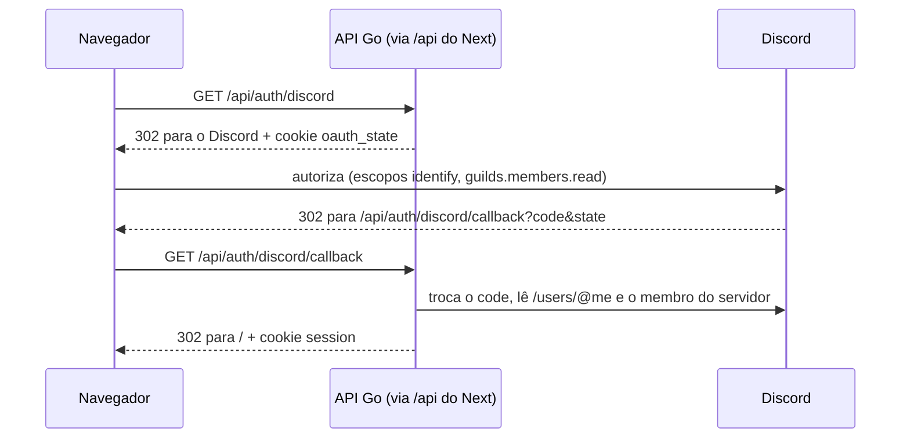

# Contrato — Fatia 2: login com Discord

Objetivo único: o aluno entra com o Discord, ganha uma sessão, e o `POST /api/ideas` passa a usar o autor da sessão. Acaba o usuário fixo (`DEV_AUTHOR_ID`).

Mudou o contrato? Atualiza este arquivo **antes** do código.

## Fora desta fatia (de propósito)

Escolha de curso no primeiro login e prévia do mural para visitante (fatia 3), perfil, logout de todos os dispositivos, limpeza de sessões expiradas.

## Quem pode entrar

Só quem é **membro do servidor Discord da comunidade** (`DISCORD_GUILD_ID`). Quem não é membro não ganha usuário nem sessão.

## Fluxo



O navegador sempre fala com o domínio do front; o Next (local) e o Caddy (produção) repassam `/api/*` para o Go. Assim os cookies ficam no domínio do front, sem CORS.

## Banco

Tabela `sessions` (nova):

| coluna | tipo | regra |
|---|---|---|
| token_hash | bytea | PK; SHA-256 do token do cookie (o token em si nunca é gravado) |
| user_id | bigint | FK → users.id, obrigatório, `ON DELETE CASCADE` |
| expires_at | timestamptz | obrigatório; criação + 30 dias |

Tabela `users`: sem mudança de colunas. A cada login, `name` e `avatar_url` são regravados com os dados atuais do Discord (upsert por `discord_id`).

- `name` = `global_name` do Discord; se vazio, `username`.
- `avatar_url` = `https://cdn.discordapp.com/avatars/<discord_id>/<avatar>.png`; `null` se o usuário não tem foto.

## Cookies

| cookie | conteúdo | atributos |
|---|---|---|
| `oauth_state` | texto aleatório | `HttpOnly`, `SameSite=Lax`, `Path=/api/auth`, 10 minutos; apagado no callback |
| `session` | token aleatório | `HttpOnly`, `SameSite=Lax`, `Path=/`, 30 dias |

Os dois ganham `Secure` quando `DISCORD_REDIRECT_URL` começa com `https://` (produção). `SameSite=Lax` impede que outro site faça `POST` levando a sessão (proteção contra CSRF).

## Endpoints

### `GET /api/auth/discord` — começa o login

Responde `302` para a tela de autorização do Discord e grava `oauth_state`.

### `GET /api/auth/discord/callback` — volta do Discord

Sempre responde `302`:

| situação | destino |
|---|---|
| deu certo | `/` (grava `session`) |
| aluno cancelou no Discord (`?error=...`) | `/login?erro=cancelado` |
| não é membro do servidor | `/login?erro=fora_do_servidor` |
| `state` ausente ou diferente do cookie, ou qualquer falha (Discord fora, banco) | `/login?erro=falhou` |

### `GET /api/me` — quem está logado

`200 OK`:

```json
{ "id": 1, "name": "Ana", "avatar_url": "https://cdn.discordapp.com/avatars/…png", "course": null }
```

`avatar_url` e `course` podem ser `null`. Sem sessão válida: `401 { "error": "unauthenticated" }`.

### `POST /api/auth/logout` — sai

Apaga a sessão no banco e o cookie. Responde `204`, com ou sem sessão.

### Mudança na fatia 1

`POST /api/ideas` sem sessão válida responde `401 { "error": "unauthenticated" }`. O autor da ideia é o usuário da sessão. `GET /api/ideas` continua público.

## Variáveis de ambiente

| variável | quem lê | exemplo |
|---|---|---|
| `DISCORD_CLIENT_ID` | API | do Developer Portal |
| `DISCORD_CLIENT_SECRET` | API | segredo, só no `.env` |
| `DISCORD_REDIRECT_URL` | API | `http://localhost:3000/api/auth/discord/callback` |
| `DISCORD_GUILD_ID` | API | id do servidor da comunidade |
| `DISCORD_INVITE_URL` | front | convite permanente do servidor |

As quatro da API são obrigatórias: sem elas a API não sobe.

## Front

- `/login`: título, botão "Entrar com Discord" (link para `/api/auth/discord`) e a mensagem do `?erro=`. Em `fora_do_servidor`, mostra o link de convite. Quem já está logado vai para `/`.
- Cabeçalho em todas as páginas: logado → foto, nome e "Sair"; visitante → link "Entrar".
- Mural: formulário de postar só para quem está logado; visitante vê "Entre para postar uma ideia".

## Pronto quando

- [ ] `goose up` cria `sessions`.
- [ ] Entrar pelo Discord cria o usuário, grava a sessão e cai no mural logado.
- [ ] Conta fora do servidor volta para `/login` com o convite.
- [ ] Postar ideia usa o autor logado; sem sessão, `401`.
- [ ] "Sair" apaga a sessão.
- [ ] Testes dos handlers cobrindo sucesso e falhas do callback, `/api/me` e logout.
