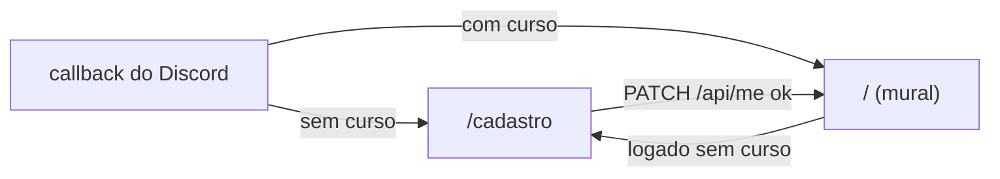

# Contrato — Fatia 3: cadastro de curso e prévia do mural

Objetivo único: todo aluno logado tem um curso, e o visitante vê só uma amostra do mural, o que o convida a entrar.

Mudou o contrato? Atualiza este arquivo **antes** do código.

## Fora desta fatia (de propósito)

Trocar o curso depois do cadastro (vem com o perfil), habilidades no cadastro, paginação do mural, contagem de quantas ideias o visitante não está vendo.

## Banco

Sem migration. A coluna `users.course` (fatia 1) passa a ser preenchida no cadastro; `null` = cadastro pendente.

## Cadastro obrigatório

O aluno logado sem curso é sempre mandado para `/cadastro` até escolher. Depois de escolher, vai para o mural (`/`).



Cursos válidos: os mesmos da [fatia 1](fatia-1-mural.md#listas-fixas) (`cc`, `eng`, `ads`).

## Endpoints

### `PATCH /api/me` — escolhe o curso

Requisição:

```json
{ "course": "cc" }
```

Resposta `200 OK`, o mesmo corpo do `GET /api/me`:

```json
{ "id": 1, "name": "Ana", "avatar_url": "https://cdn.discordapp.com/avatars/…png", "course": "cc" }
```

Regras: `course` passa por trim antes de validar; o valor gravado é o limpo. Corpo limitado a 64 KB; campos desconhecidos são ignorados.

Erros:

- `400` — curso faltando ou fora da lista:

```json
{ "error": "validation_failed", "fields": { "course": "valor inválido" } }
```

  Mensagens: `"obrigatório"` (vazio ou só espaços) e `"valor inválido"` (fora da lista).
- `400` — JSON malformado ou com tipo errado: `{ "error": "invalid_json" }`.
- `401` — sem sessão válida: `{ "error": "unauthenticated" }`.
- `413` — corpo acima de 64 KB: `{ "error": "body_too_large" }`.
- `500` — `{ "error": "internal" }`.

### Mudança na fatia 2: `GET /api/auth/discord/callback`

No login que dá certo, o destino depende do curso:

| situação | destino |
|---|---|
| usuário sem curso (primeiro login) | `/cadastro` |
| usuário com curso | `/` |

Os destinos de erro não mudam.

### Mudança na fatia 1: `GET /api/ideas`

| quem chama | itens |
|---|---|
| visitante (sem sessão válida) | no máximo as **3** mais recentes |
| logado | todas |

O formato `{ "items": [...] }` não muda. O corte é na API: o visitante não recebe o mural inteiro nem chamando a API direto.

## Front

- `/cadastro`: visitante vai para `/login`; quem já tem curso vai para `/`. Senão, formulário com o select de curso (rótulos da fatia 1), erro por campo vindo do `400` e, no sucesso, vai para `/`.
- Mural (`/`): logado sem curso vai para `/cadastro`. Visitante vê a lista e, depois dela, o bloco "🔒 Entre com Discord para ver o mural todo" com link para `/login`.
- O mural é renderizado no servidor do Next, que chama a API Go direto: ele repassa o cookie do navegador, senão a API sempre o trataria como visitante.

## Pronto quando

- [ ] Primeiro login cai em `/cadastro`; escolher o curso leva ao mural; logins seguintes vão direto para `/`.
- [ ] Logado sem curso não consegue ficar no mural.
- [ ] `PATCH /api/me` válido grava o curso; inválido responde `400` com o campo; sem sessão, `401`.
- [ ] Visitante vê no máximo 3 ideias e o convite para entrar; logado vê todas.
- [ ] Testes dos handlers cobrindo o `PATCH`, o destino do callback e o limite do visitante.
